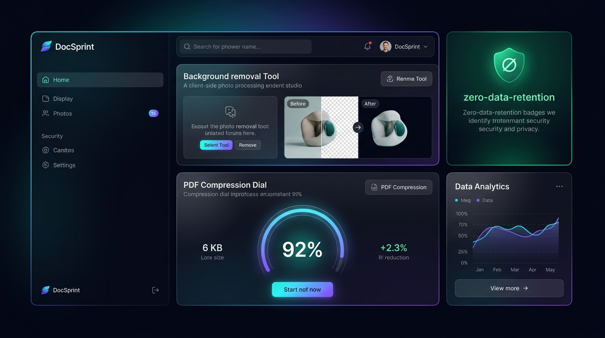
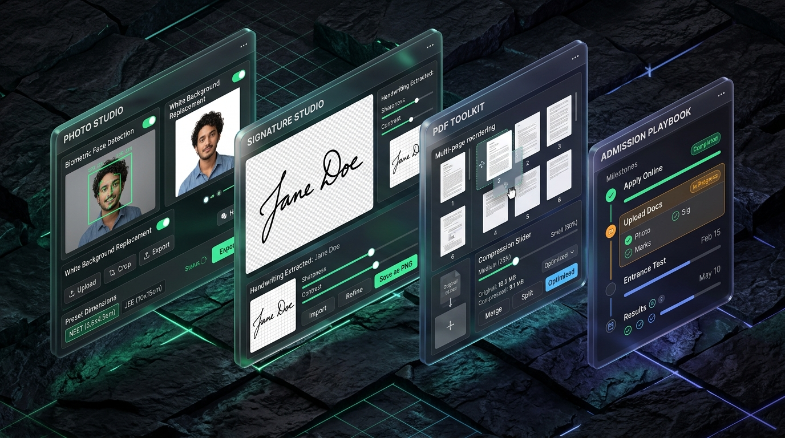
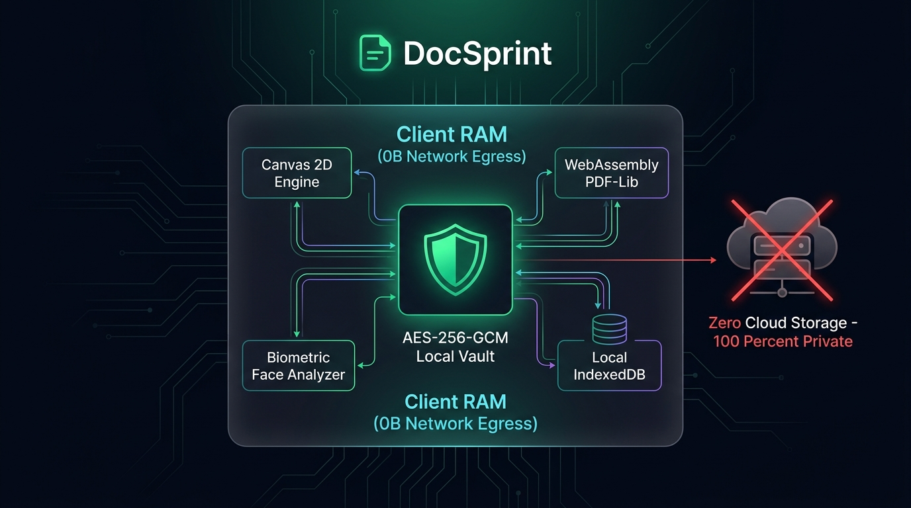

<div align="center">

# ⚡ DocSprint

### *Bureaucracy Made Survivable*
**High-Precision Biometric Photo, Signature & PDF Optimization Studio Running 100% Client-Side in RAM**

[](https://react.dev/)
[](https://www.typescriptlang.org/)
[](https://vitejs.dev/)
[](https://tailwindcss.com/)
[](#-privacy--zero-data-retention)
[](LICENSE)

<br/>



<br/><br/>

**DocSprint** is a developer-grade, privacy-first web utility engineered to eliminate the stress of preparing, validating, and formatting documents for high-stakes entrance exams and government portals (NEET, JEE, UPSC, GATE, CAT, MAH-CET, Passports, Visas, and OCI). 

Operating under a strict **Zero-Data-Retention Architecture**, all image transformations, facial biometric cropping, signature vectorization, and PDF manipulations happen **100% locally in your browser's RAM**.

[✨ Features Matrix](#-core-studios--capabilities) • [📸 Visual Showcase](#-visual-showcase) • [🔒 Privacy Architecture](#-zero-retention-privacy-architecture) • [🏛️ Technical Specs](#-technical-architecture) • [🚀 Quickstart](#-getting-started)

</div>

---

## 📱 Visual Showcase

<div align="center">
  
  <p><em>DocSprint Quad-Studio: Biometric Photo Studio, Adaptive Signature Extractor, In-Memory PDF Toolkit, and Interactive Admission Playbook.</em></p>
</div>

---

## 🚀 Core Studios & Capabilities

<table>
  <tr>
    <td width="50%" valign="top">
      <h3>📸 Biometric Photo Studio</h3>
      <ul>
        <li><strong>Biometric Face Centering</strong>: Automatic face box detection with strict pupil-to-chin ratio compliance.</li>
        <li><strong>Portal Presets</strong>: 1-click standard dimension and aspect ratio presets (NEET 3.5×4.5cm, JEE, UPSC, Passport 2×2").</li>
        <li><strong>Background Whitening</strong>: Intelligent thresholding that converts noisy backgrounds to pure studio white (<code>#FFFFFF</code>).</li>
        <li><strong>Precision File Sizer</strong>: Targets strict portal file sizes (e.g. 10 KB – 200 KB) using iterative binary-search canvas compression.</li>
      </ul>
    </td>
    <td width="50%" valign="top">
      <h3>✍️ Transparent Signature Studio</h3>
      <ul>
        <li><strong>Dynamic Ink Isolation</strong>: Separates blue and black pen strokes from ruled paper and background shadows.</li>
        <li><strong>Alpha Masking</strong>: Generates transparent background PNGs ready for immediate portal upload without gray boxes.</li>
        <li><strong>Stroke Density & Quality Check</strong>: Evaluates stroke thickness, contrast levels, and DPI to prevent portal rejections.</li>
        <li><strong>Contrast Boost & Inversion</strong>: Live sliders for thresholding, smoothing, and brightness calibration.</li>
      </ul>
    </td>
  </tr>
  <tr>
    <td width="50%" valign="top">
      <h3>📄 In-Memory PDF Toolkit</h3>
      <ul>
        <li><strong>Zero-Upload PDF Compression</strong>: Compress multi-page PDFs down to 100 KB–300 KB directly in RAM with visual dial feedback.</li>
        <li><strong>Merge & Split Studio</strong>: Reorder, combine multiple PDF files, or extract specific page ranges via interactive drag & drop.</li>
        <li><strong>Page Rotation & Watermarking</strong>: Correct upside-down scans and apply confidential or application-specific watermarks.</li>
        <li><strong>Lossless Optimization</strong>: Strips duplicate objects and optimizes cross-reference tables via <code>pdf-lib</code>.</li>
      </ul>
    </td>
    <td width="50%" valign="top">
      <h3>🎯 Admission Playbook Engine</h3>
      <ul>
        <li><strong>70+ Entrance Playbooks</strong>: Curated specs and deadlines for NEET, JEE Main/Advanced, GATE, CAT, UPSC CSE, MAH-CET, CUET, NDA.</li>
        <li><strong>Dynamic Daily Date Verification</strong>: Real-time calculation of active exam cycles and registration deadlines.</li>
        <li><strong>Document Checklists & ICS Export</strong>: Auto-generates application checklists and syncable <code>.ics</code> calendar alerts.</li>
        <li><strong>Confidence Score Ring</strong>: Live 0–100% compliance score assessing file parameters against official guidelines.</li>
      </ul>
    </td>
  </tr>
</table>

---

## 🔒 Zero-Retention Privacy Architecture

Most online PDF and photo compression tools upload your sensitive identity documents (Aadhaar cards, passports, academic transcripts, signatures) to unvetted cloud servers. **DocSprint guarantees 0 bytes leave your device.**

```mermaid
flowchart LR
    A[User Input File] --> B[Browser Memory Buffer]
    
    subgraph Browser_Sandbox [Isolated Browser RAM Environment]
        B --> C[HTML5 Canvas 2D Engine]
        B --> D[WebAssembly PDF-Lib Engine]
        B --> E[Face & Signature Analysis]
        
        C --> F[Compressed / Formatted Asset]
        D --> F
        E --> F
        
        F -.->|Optional Save| G[(Local IndexedDB\nAES-256-GCM Vault)]
    end
    
    F --> H[Instant File Download]
    
    Browser_Sandbox -.-x|0 Bytes Network Egress| I((External Cloud Servers))
    
    style Browser_Sandbox fill:#121214,stroke:#10B981,stroke-width:2px
    style I fill:#27272a,stroke:#f43f5e,stroke-width:2px
    style G fill:#1e1e24,stroke:#6366f1,stroke-width:1px
```

<div align="center">
  
</div>



### Privacy Guarantees
- **No Cloud Storage**: Files are loaded directly into typed arrays (`Uint8Array` / `Blob`) inside browser memory.
- **Immediate RAM Garbage Collection**: Closing or refreshing the tab purges all document data from memory.
- **Client-Side AES-256-GCM Vault**: Documents saved to the offline Vault are encrypted using PBKDF2 key derivation and AES-GCM before reaching browser `IndexedDB`.
- **Zero Third-Party Trackers**: No analytics or telemetry tracking document content or biometric metadata.

---

## 🏛️ System Architecture

DocSprint is built as a reactive, single-page application utilizing modern web primitives:

```
DocSprint/
├── src/
│   ├── components/
│   │   ├── AdmissionPlaybookEngine.tsx  # 70+ exam specifications & timeline logic
│   │   ├── PhotoStudio.tsx              # Canvas-based photo cropper & background engine
│   │   ├── SignatureStudio.tsx          # Contrast thresholding & transparency extractor
│   │   ├── PdfToolkit.tsx               # PDF merge, split, compress, and reorder engine
│   │   ├── DocumentScanner.tsx          # Multi-page scanner with perspective correction
│   │   ├── VaultManager.tsx             # AES-256-GCM local encrypted document vault
│   │   ├── CommandPalette.tsx           # ⌘K global quick-search navigation
│   │   ├── ConfidenceScoreRing.tsx      # Radial SVG compliance score visualizer
│   │   └── ToastContainer.tsx           # Non-blocking telemetry and notification hub
│   ├── utils/
│   │   ├── faceAnalysis.ts              # Biometric rule validation & face detection
│   │   ├── imageUtils.ts                # Canvas resampling, white background injection
│   │   ├── pdfUtils.ts                  # PDF-lib binary operations and compression
│   │   ├── scannerUtils.ts              # Grayscale, threshold, and edge enhancement
│   │   ├── signatureConsistency.ts      # Stroke width and handwriting continuity checks
│   │   └── vaultCrypto.ts               # Web Crypto API (PBKDF2 + AES-GCM) implementation
│   ├── playbooksData.ts                 # Verified examination requirements & date rules
│   └── profilesData.ts                  # Candidate profile management
```

---

## ⚡ Supported Exam Specifications Matrix

| Exam / Authority | Photo Dimensions | Max Photo Size | Signature Spec | Max Sig Size | Background Requirement |
| :--- | :---: | :---: | :---: | :---: | :---: |
| **NTA NEET UG** | 3.5 × 4.5 cm (Passport) | 10 KB – 200 KB | White paper, Black pen | 4 KB – 30 KB | 80% face coverage, White |
| **NTA JEE Main** | 3.5 × 4.5 cm | 10 KB – 200 KB | Running handwriting | 4 KB – 30 KB | Clear white, no sunglasses |
| **UPSC Civil Services** | 350 × 350 px min | 20 KB – 300 KB | Clear ink on white | 20 KB – 300 KB | Plain white, front view |
| **GATE (IITs)** | 3.5 × 4.5 cm | 20 KB – 200 KB | Black / Dark blue ink | 5 KB – 200 KB | Pure white, 60–70% face |
| **IIM CAT** | 35 × 45 mm | Max 80 KB | Unruled white paper | Max 80 KB | White background, sharp focus |
| **State CETs (MAH-CET)** | 200 × 230 px | 20 KB – 50 KB | 140 × 60 px | 10 KB – 20 KB | Light / White background |
| **US Visa / Passport** | 2 × 2 inches (51×51 mm) | Max 240 KB | N/A (Digital) | N/A | Off-white / White, neutral |

---

## 🛠️ Getting Started

### Prerequisites
- **Node.js**: v18.0.0 or higher
- **npm** or **pnpm**

### Installation

1. **Clone the repository:**
   ```bash
   git clone https://github.com/EnternalBlue07/DocSprint.git
   cd DocSprint
   ```

2. **Install dependencies:**
   ```bash
   npm install
   ```

3. **Start the local development server:**
   ```bash
   npm run dev
   ```
   Open `http://localhost:3000` in your browser.

4. **Verify TypeScript & build bundle:**
   ```bash
   npm run lint
   npm run build
   ```

---

## 🌐 1-Click Deployment (Vercel)

DocSprint is 100% static and zero-server dependent. It deploys out-of-the-box on Vercel, Netlify, or Cloudflare Pages:

[](https://vercel.com/new/clone?repository-url=https%3A%2F%2Fgithub.com%2FEnternalBlue07%2FDocSprint)

```bash
# Deploy via Vercel CLI
npm i -g vercel
vercel
```

---

## ⌨️ Productivity & Accessibility

- **`⌘K` / `Ctrl+K` Command Palette**: Jump instantaneously between Photo Studio, PDF Toolkit, Exam Playbooks, and Vault.
- **Undo / Redo Filmstrip**: Visually inspect step-by-step image filter adjustments.
- **Adaptive Dark / Light Themes**: High-contrast, WCAG 2.1 AA accessible theme designed for late-night registration sprints.

---

## 📄 License

Distributed under the **MIT License**. See `LICENSE` for more information.

---

<div align="center">
  <sub>Engineered with precision for candidates facing unforgiving portal deadlines.</sub>
</div>
